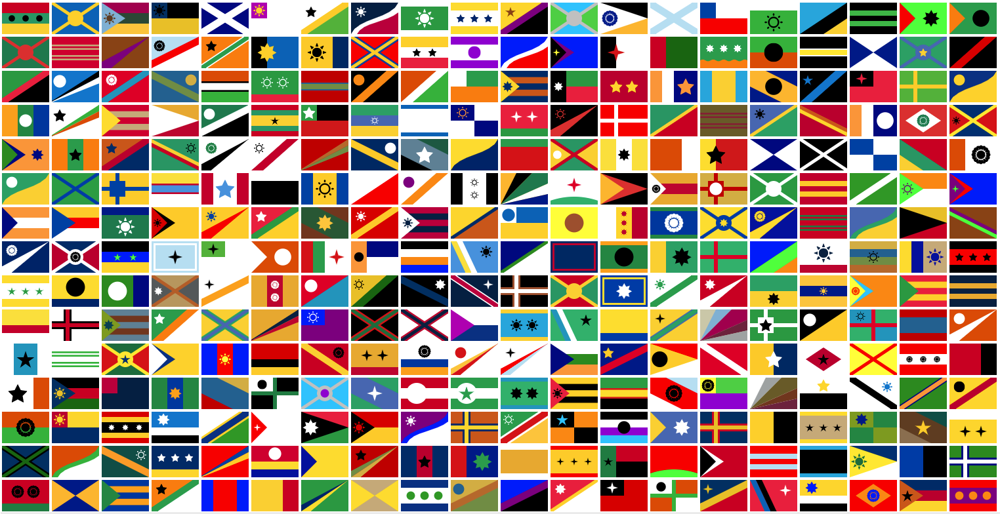

# Flagspiration
Randomly generated flags based on common national and city flag patterns and vexillological principles.

* https://flagspiration.com

## Overview

The flag patterns are largely based on actual national and city flags, with variations that may not be in use.

Click on a flag to see a formulaic (and possibly inaccurate) vexillological description and cross references to existing flags using this pattern.

## Ideas

François Best's [Representing SHA-256 Hashes As Avatars](https://francoisbest.com/posts/2021/hashvatars) inspired me to think about flags as avatars. Square flags at small sizes are easily distinguishable. This could be an interesting application.

## Acknowledgements

This started as a hack, written completely client-side, and so a few files were copied in directly.

* https://github.com/eligrey/FileSaver.js - for saving flags
* https://chir.ag/projects/ntc/ - Name that Color functionality used to describe the flag colors; this uses a huge palette, and could more usefully be restricted to a simple color palette
* https://github.com/developit/snarkdown

## Vexillological Resources

* https://nava.org/good-flag-bad-flag
* https://en.wikipedia.org/wiki/Glossary_of_vexillology
* https://fotw.info - a great resource I used a lot
* https://en.wikipedia.org/wiki/Lists_of_city_flags
* https://www.civicheraldry.co.uk/wales_current.html - examples of heraldic description

### Ordinaries
* https://rarebooks.library.nd.edu/digital/heraldry/charges/ordinaries_4.shtml
* https://www.internationalheraldry.com/
* https://www.theheraldrysociety.com/wp-content/uploads/2018/03/Heraldry-For-Beginners.pdf
* https://www.theheraldrysociety.com/articles/the-language-of-blazon/

### Colors

* https://www.flagcolorcodes.com/
* https://en.wikipedia.org/wiki/Color_Association_of_the_United_States
* https://usafpatches.com/reference-shelf/palettes/

### Heraldic Shields
* https://drawshield.net/
* https://drawshield.net/resources/downloads/poster-plain.pdf
* https://en.wikipedia.org/wiki/Ordinary_(heraldry)

### Heraldic Ordinaries
* https://heraldica.hypotheses.org/4623 - Interesting notes on German use of three sizes for fess, etc.
* https://www.heraldica.org/topics/glossary/atlas.htm - Very useful visual atlas with many options in multiple languages **GOOD**
* http://herald.poore-house.com/design/chevronsandpiles/ - Excellent explanation of Chevrons, Piles, etc.

### Random Research Notes
* *Heraldry in America*, by Zieber, Eugene
https://archive.org/details/gri_33125013598905/page/n277/mode/1up

* *The Manual of Heraldry, Being a Concise Description of the Several Terms Used, and Containing a Dictionary of Every Designation in the Science* By Sir Francis James Grant · 1894
https://www.google.com/books/edition/The_Manual_of_Heraldry/6MJsAAAAMAAJ?hl=en&gbpv=1&dq=Heraldic+Dictionary+by+James+Dignan&printsec=frontcover

* *Pimbley's dictionary of heraldry* by Pimbley, Arthur Francis
https://archive.org/details/pimbleysdiction00pimbgoog

Note: Fess = 1/3, Bar = 1/5, Closet = 1/2 Bar, Barrulet = 1/4 Bar

Note: Pale = 1/2; Pallet = 1/2 Pale, Endorse = 1/4 Pale

Note: Bend = 1/3 width when charged, or 1/5 otherwise; Bendlet = 1/2 Bend, Cost (or Cotise) = 1/4 Bend, Riband or Ribbon is Cotise with ends trimmed

Cotised is when something is surrounded by two cotises

